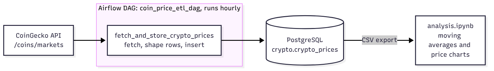

# Crypto Price ETL with Apache Airflow

An hourly pipeline that fetches market data for 15 cryptocurrencies from the CoinGecko API and stores each snapshot in PostgreSQL, building a price history you can analyze.

## Architecture



## How it works

1. **Extract**: one request to CoinGecko returns the current price, market cap and total volume in USD for 15 coins, including Bitcoin, Ethereum, Solana and Cardano.
2. **Transform**: each coin becomes one row with its name, upper-case symbol, the three values and a UTC timestamp.
3. **Load**: the task creates the `crypto` schema and `crypto_prices` table if they are missing, then inserts the rows. If the insert fails, the transaction is rolled back.
4. **Schedule**: the DAG runs every hour, retries twice with a two-minute delay, and can email on failure if SMTP is set up in Airflow.
5. **Analyze**: `analysis.ipynb` reads a CSV export of the table and plots each coin's price with 6-hour and 24-hour moving averages, marking local lows and highs.

## Run it

You need Python 3, Apache Airflow 2 and a PostgreSQL database.

```bash
git clone https://github.com/Ambuso/Crypto-etl-airflow.git
cd Crypto-etl-airflow

python -m venv venv
source venv/bin/activate
pip install apache-airflow requests psycopg2-binary python-dotenv
```

Create a `.env` file where Airflow can read it:

```
DB_NAME=your_database
DB_HOST=your_host
DB_USER=your_user
DB_PASSWORD=your_password
DB_PORT=5432
```

Copy `crypto_dags.py` into your Airflow `dags/` folder, open the Airflow UI, and turn on `coin_price_etl_dag`. Trigger it once by hand to check that rows arrive in the table.

For the notebook, install `pandas` and `matplotlib` and change `csv_path` in the second cell to point at your own CSV export.

## Output table

`crypto.crypto_prices`

| Column | Type | Meaning |
|---|---|---|
| name | text | Coin name, for example Bitcoin |
| symbol | text | Ticker, for example BTC |
| price | numeric | Price in USD |
| market_cap | numeric | Market capitalization in USD |
| total_volume | numeric | Trading volume in USD |
| timestamp | timestamp | When the snapshot was taken (UTC) |

## Files

```
crypto_dags.py                    Airflow DAG with the ETL task
analysis.ipynb                    Price charts and moving averages
crypto_prices_202506040256.csv    Sample export of the table
```

## Built with

Python, Apache Airflow, PostgreSQL, CoinGecko API, pandas, matplotlib
